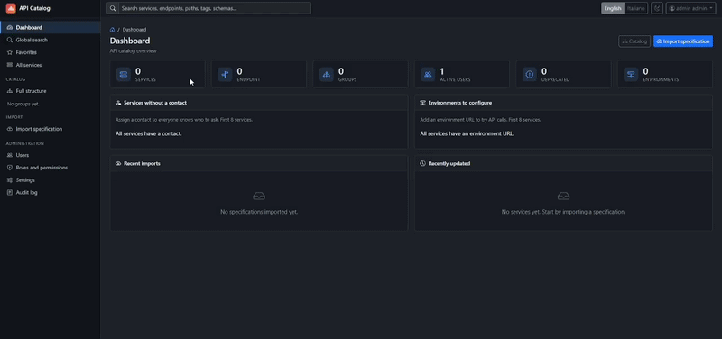
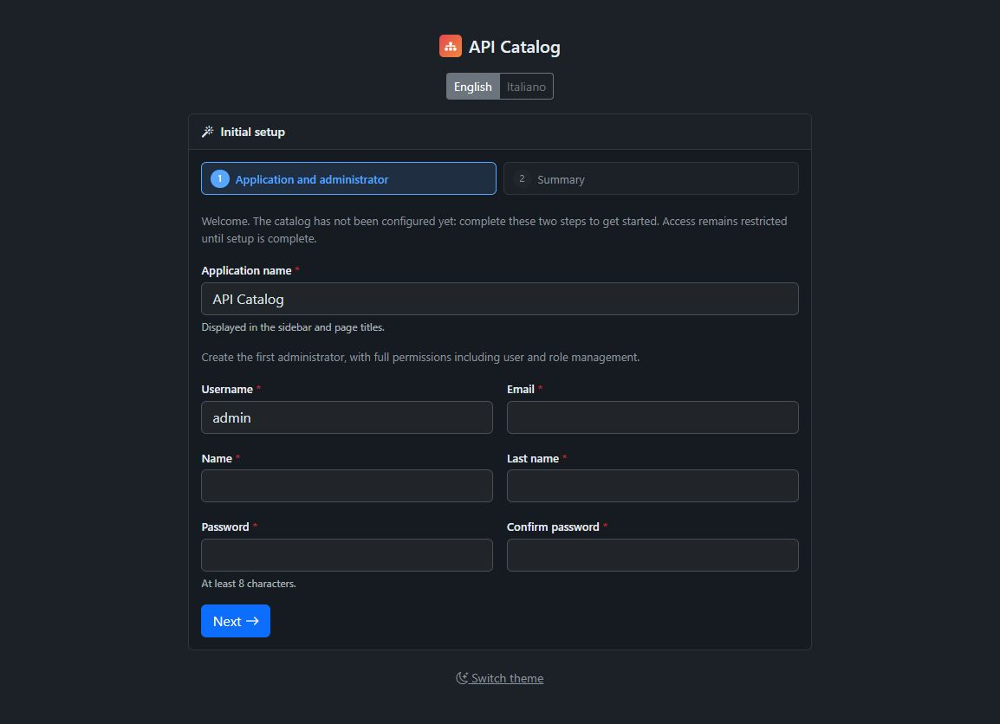
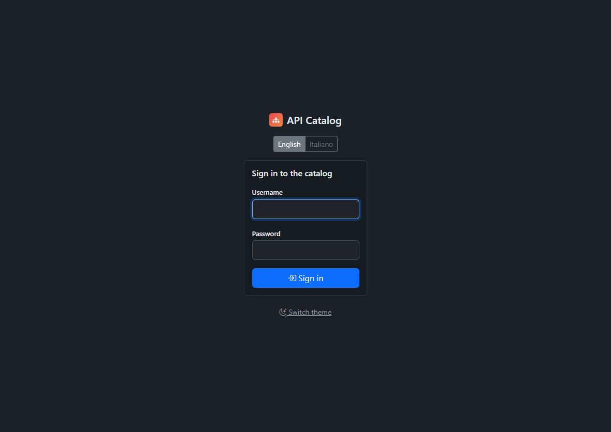
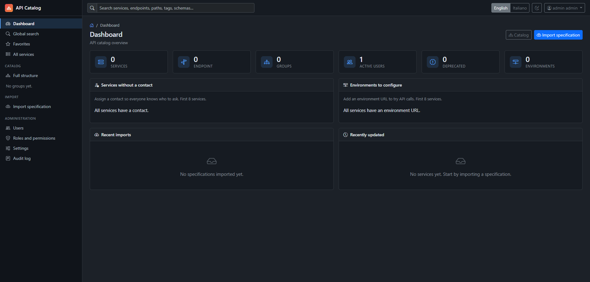
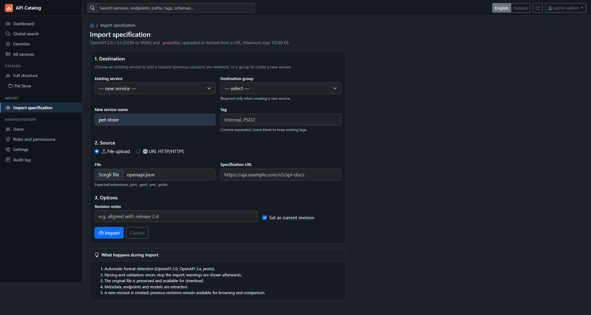
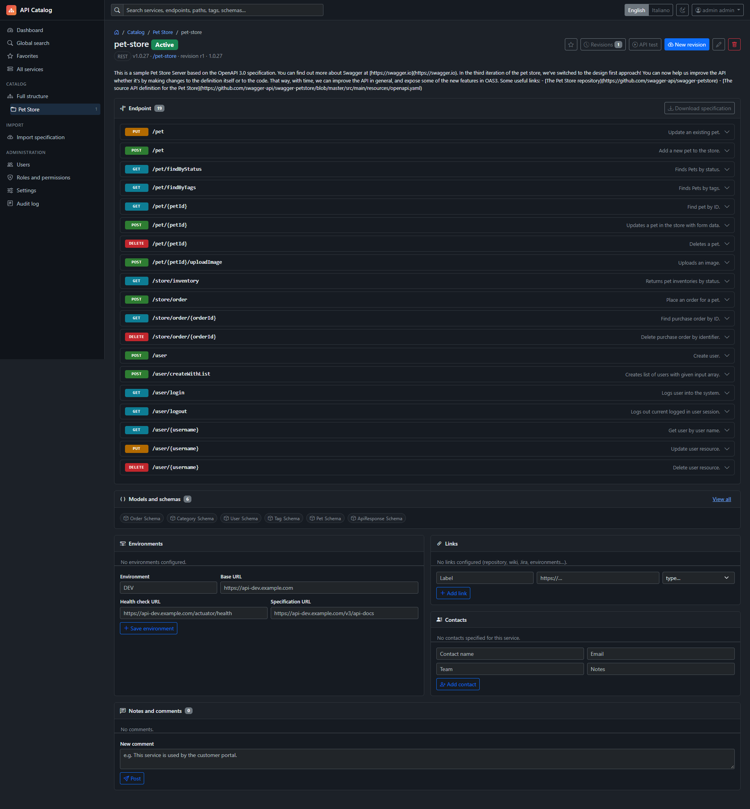
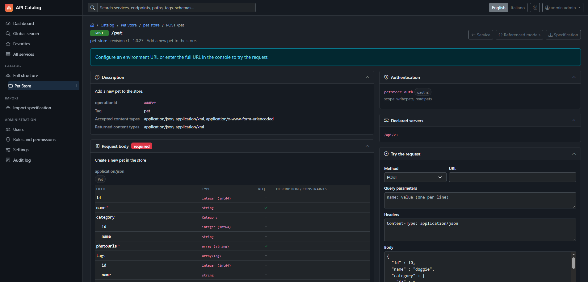

<div align="center">

#  Red Fish API Catalog

**A central place to discover, document, and test your team's APIs.**

REST · gRPC · OpenAPI · Versioning · API Testing

Java 21 · Spring Boot 3.4 · PostgreSQL

</div>

---

Red Fish API Catalog brings services, specifications, and operational information together in one portal. Organize APIs by area, explore endpoints and models, compare revisions, and try HTTP requests directly from the interface.

The application ships as **a single JAR**, with frontend assets included and PostgreSQL persistence. It requires neither a Node.js build nor container infrastructure.



## Features

| Area | Features |
| --- | --- |
| **Organize** | Hierarchical groups and subgroups, REST/gRPC services, tags, contacts, and documentation. |
| **Import** | Swagger/OpenAPI 2.0 and OpenAPI 3.x specifications in JSON or YAML, and `.proto` files, uploaded or fetched from HTTP/HTTPS URLs. |
| **Explore** | Endpoints, parameters, request bodies, responses, authentication, schema trees, and generated examples. |
| **Browse models** | Model details, cross-references, and filtering by models used by an endpoint. |
| **Version** | Revision history, current version selection, original file downloads, and endpoint and model diffs. |
| **Test** | HTTP console with headers, parameters, and request bodies; response status, duration, and size; cURL command generation. |
| **Monitor services** | Multiple environments, periodic health checks, external links, favorites, and comments on services and endpoints. |
| **Manage access** | ADMIN, EDITOR, and VIEWER roles, custom roles, group permissions, and operation auditing. |

Global search supports filters for groups and subgroups, service type, and service status, with 20 results per section per page and limits applied by the database. The dashboard highlights unreachable environments, services without contacts, and services without an environment URL, linking to their details. The application name, logo, and operational settings can be customized from the interface, which also includes a dark theme.

### From contract to request

1. **Create the catalog structure** by domain, team, or application area.
2. **Import a specification** and browse the extracted endpoints and models.
3. **Add service environments**, contacts, and useful links.
4. **Try an HTTP request** or copy the generated command.
5. **Import a new revision** and compare it with the previous one.

The console sends HTTP requests from the application server. Both the console and cURL use the full URL of the selected environment. In automatic mode, the first environment with a URL is selected; otherwise, the first absolute HTTP/HTTPS server URL in the specification is used. URLs with unresolved variables and relative server URLs require an explicit environment URL. If no address is available, the console asks for the full URL and does not generate a command targeting a default host.

Revision comparisons separately highlight potentially breaking changes: removed endpoints and models, new required parameters or request bodies, type changes, removed fields, and narrowed enums, including those in nested schemas. This helps with reviews but does not provide a complete compatibility certification.

For gRPC, contract browsing and `grpcurl` command generation are available; the HTTP console does not execute gRPC calls.

## Quick start

### Prerequisites

- **JDK 21**.
- **Maven 3.9+** to build the project.
- A reachable **PostgreSQL** server and a dedicated database.

### 1. Create the database

From a PostgreSQL session with the required permissions:

```sql
CREATE DATABASE redfish_catalog ENCODING 'UTF8';
```

Flyway creates the schema and initial data on the first startup.

### 2. Build

From the project directory:

```sh
mvn clean package
```

This command runs the tests and produces `target/red-fish-api-catalog.jar`.

### 3. Configure and run

By default, the application connects to PostgreSQL at `localhost:5432`, using the `redfish_catalog` database and `postgres` as both username and password.

```sh
java -jar target/red-fish-api-catalog.jar
```

To use different credentials, set the `DB_USER` and `DB_PASSWORD` environment variables before starting the application. For example, in a POSIX shell:

```sh
DB_USER=catalog DB_PASSWORD='your-password' java -jar target/red-fish-api-catalog.jar
```

### 4. Complete the initial setup

Open [localhost:8080](http://localhost:8080). The initial setup wizard lets you:

1. Choose the application name and create the first administrator.
2. Review the summary and optionally generate a sample group structure.

The first step collects the application name and the administrator's username, email, first name, last name, and password (at least eight characters), plus password confirmation. Use the **English** and **Italiano** links to select the interface language.



Once completed, the wizard is disabled and the catalog is ready for its first import.

Sign in with the administrator credentials created during setup.



### Sample specifications

| File | Contents |
| --- | --- |
| [payments-sepa-openapi3.yaml](examples/payments-sepa-openapi3.yaml) | REST API for SEPA payments, with parameters, enums, schema references, and bearer authentication. |
| [notification-v1.proto](examples/notification-v1.proto) | gRPC notification service with messages, enums, `oneof`, and unary and streaming RPCs. |

Use **Import specification**, select the target group, and upload one of these files.

## A tour of the catalog

### Dashboard

After signing in, the dashboard shows catalog counters, recent imports, recently updated services, and services that need contacts or environment URLs. Use the sidebar to browse the catalog or **Import specification** to add your first service.



### Import a specification

Choose a destination group to create a new service, or select an existing service to add a revision. Upload a Swagger/OpenAPI file or provide its HTTP/HTTPS URL, then optionally add tags and revision notes and choose whether to make the revision current.



### Browse an imported service

The service page lists the endpoints and models extracted from the specification. It also provides access to revisions and the original specification, alongside sections for environments, links, contacts, and comments. This example shows the imported Pet Store API.



### Explore an endpoint

Open an endpoint to inspect its description, authentication requirements, request body, and referenced models. The HTTP console lets you enter a URL, query parameters, headers, and a request body. Configure an environment URL or enter the full URL in the console before trying the request.



## Configuration

The main environment variables are defined in [application.yml](src/main/resources/application.yml).

| Variable | Default | Purpose |
| --- | --- | --- |
| `DB_HOST` | `localhost` | PostgreSQL host. |
| `DB_PORT` | `5432` | PostgreSQL port. |
| `DB_NAME` | `redfish_catalog` | Database name. |
| `DB_USER` | `postgres` | Database username. |
| `DB_PASSWORD` | `postgres` | Database password. |
| `PORT` | `8080` | Application HTTP port. |
| `CATALOG_STORAGE` | `data/storage` | Directory for uploaded files, such as the logo. |
| `THYMELEAF_CACHE` | `true` | Template cache; set to `false` during development. |

Administrative settings let you change the name, logo, upload limit, API test timeout, and health check interval. The initial application upload limit is 10 MiB; the configured multipart limits are 20 MB per file and 24 MB per request.

URL imports, API tests, and health checks use the network connectivity of the server running the catalog. Bootstrap assets and icons are included in the JAR through WebJars.

## Architecture

The interface is rendered on the server using Spring MVC and Thymeleaf. Application logic handles imports, versioning, permissions, and service checks; Spring Data JPA persists data in PostgreSQL.

| Component | Technology |
| --- | --- |
| Runtime and backend | Java 21, Spring Boot 3.4.5, Spring MVC |
| Interface | Thymeleaf, Bootstrap 5.3.3, Bootstrap Icons, JavaScript, and CSS |
| Security | Spring Security, BCrypt passwords, sessions, and CSRF protection |
| Persistence | Spring Data JPA, PostgreSQL, Flyway |
| Parsing | Swagger Parser and a dedicated proto file parser |
| Build and testing | Maven, JUnit, Mockito, Spring MockMvc |

```text
src/main/java/it/fn/redfish/catalog/
├── config/       Application and security configuration
├── domain/       JPA entities and enums
├── repo/         Spring Data repositories
├── security/     Authentication, permissions, and access filters
├── service/      Application logic
├── spec/         Specification parsing and schema rendering
├── support/      Utilities and exceptions
└── web/          MVC controllers and forms

src/main/resources/
├── db/migration/ SQL migrations and initial data
├── static/       CSS, JavaScript, and images
└── templates/    Thymeleaf pages and fragments

src/test/         Automated tests and fixtures
examples/         Specifications ready to import
```

Permissions assigned to a group also apply to its descendants. The system prevents an installation from being left without active administrators and records operations in an audit log.

## Development and verification

### Automated tests

```sh
mvn test
```

The suite covers parsers, schemas, model references, diffs, cURL generation, services, and MVC controllers. Unit and MockMvc tests do not require a running PostgreSQL database.

### Development startup

```sh
mvn spring-boot:run
```

To disable template caching, set `THYMELEAF_CACHE=false` before starting the application.

### Existing databases

The `V2__remove_global_api_url.sql` migration removes the obsolete `app.base.url` setting. Individual environment URLs remain available; Flyway applies the migration on the next startup.

Removing comments from the `V1__init.sql` migration changes its Flyway checksum. For installations that have already applied it, verify that the schema matches and reconcile the migration history using Flyway's `repair` procedure before startup. No action is required for a new database.
